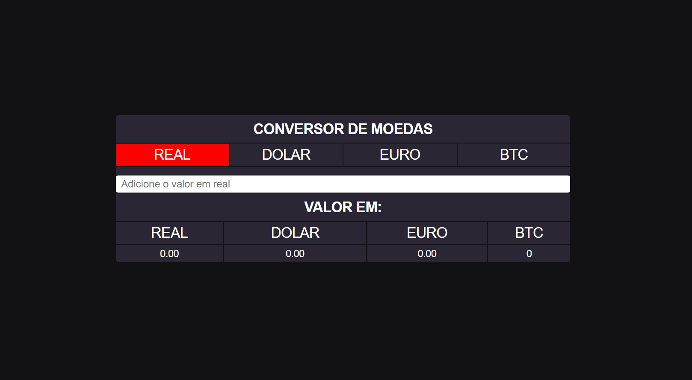
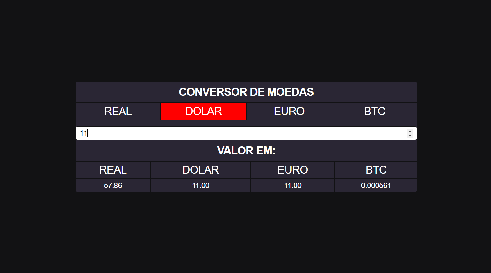
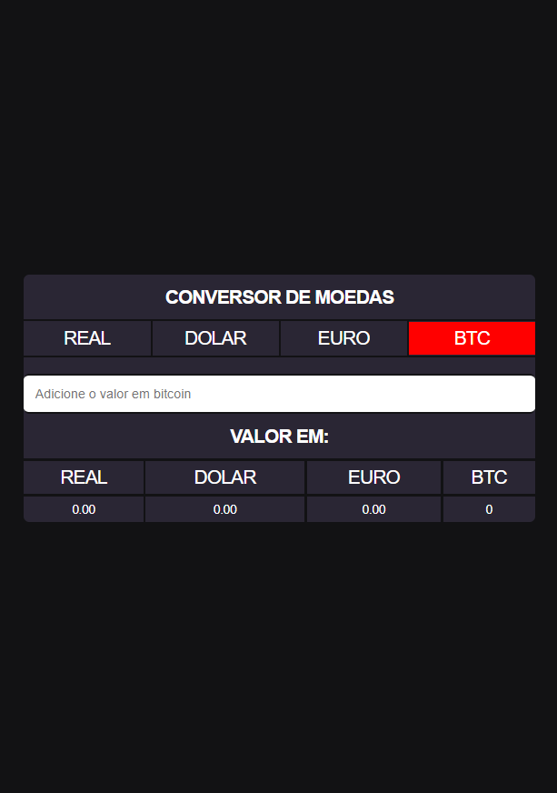

# Conversor de moedas

## Descricão:

## O projeto possuí integração a API da awesomeapi, para obter dados atualizados, relacionados as moedas, (Atualmente, apenas para conversões que o valor inicial é em real). Uma tela de carregamento será exibida até que os dados sejam recebidos.

## A conversão é feita automaticamente, assim que, a moeda de entrada é selecionada e o valor digitado.

## As moedas disponíveis são: Real, Dolar, Euro e Biticoin.

#

## Para acessar a página: [click aqui.](https://lucassantosgomes.github.io/conversor-de-moedas)

### Autor: Lucas Santos | [Git hub](https://github.com/lucassantosgomes) | [Linkedin](https://linkedin.com/in/lucas-sg/)

### Repositório: [Aqui](https://github.com/lucassantosgomes/conversor-de-moedas)

#

## Imagens:

### Resposivo.

